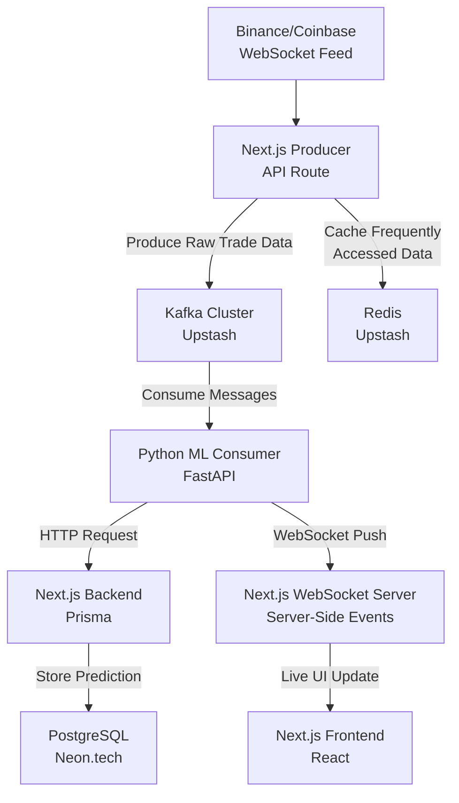

# Kratos: Real-Time Crypto Trading Analytics Engine

[](https://nextjs.org/)
[](https://www.typescriptlang.org/)
[](https://kafka.apache.org/)
[](https://www.python.org/)
[](https://redis.io/)
[](https://www.docker.com/)
[](https://aws.amazon.com/)

A high-performance, low-latency system for ingesting real-time cryptocurrency market data, generating AI-powered price predictions, and delivering them via a scalable WebSocket infrastructure. This is not a toy project; it's a prototype of the systems powering modern algorithmic trading.

##  What This Proves

This project demonstrates mastery of the full stack required for high-stakes, data-intensive applications, justifying senior and architect-level. It is built with production-grade practices from day one.

## ⚙️ Architecture & Tech Stack

### Core Services
| Service | Technology | Purpose |
| :--- | :--- | :--- |
| **Frontend** | Next.js 15, TypeScript, Tailwind CSS | Responsive UI, real-time dashboards with WebSockets. |
| **Backend API** | Next.js API Routes, TypeScript | Main application logic, authentication, Kafka producers. |
| **ML Microservice** | Python, FastAPI, Scikit-learn | Isolated model inference. Hosts the price prediction model. |
| **Data Pipeline** | Apache Kafka (via Upstash) | Decouples data ingestion from processing. Handles massive event streams. |
| **Cache & Pub/Sub** | Redis (via Upstash) | Caches API responses, manages WebSocket sessions, and real-time pub/sub. |
| **Database** | PostgreSQL (via Neon.tech) | Persistent storage for user data, trade signals, and historical predictions. |
| **Infrastructure** | Docker, AWS (EC2/ECS), Vercel | Containerized, scalable, cloud-native deployment. |

### System Architecture



## 🔥 Core Features

-   **Real-Time Order Book:** In-memory storage and matching engine for low-latency trade simulation.
-   **AI Price Predictions:** Machine learning model (Linear Regression/Random Forest) predicting short-term price movements based on live market data.
-   **Scalable Data Ingestion:** Apache Kafka buffers millions of market events, preventing data loss during spikes.
-   **Live WebSocket Dashboard:** UI updates in real-time without page refresh, showing predictions and market trends.
-   **Microservice Architecture:** The ML model is isolated in a Python FastAPI service, allowing for independent scaling and deployment.
-   **Production Ready:** Containerized with Docker, deployed on AWS, with monitoring via Prometheus/Grafana.

## 📁 Project Structure

```
kratos-trading-engine/
├── app/                    # Next.js 15 App Router
│   ├── api/               # API Routes (Kafka producers, WebSocket handlers)
│   ├── dashboard/         # Main protected application
│   └── globals.css        # Tailwind styles
├── lib/                   # Core utilities & classes
│   ├── orderbook.ts       # In-memory order book implementation
│   └── kafka.ts          # Kafka producer client
├── ml-api/                # Python ML Microservice
│   ├── main.py           # FastAPI app & /predict endpoint
│   ├── consumer.py       # Kafka consumer that runs predictions
│   └── model.joblib      # Trained ML model
├── docker-compose.yml     # Local development setup
└── README.md             # This file
```

## 🚦 Getting Started

### Prerequisites

-   Node.js 20+, Python 3.10+, Docker
-   Accounts: Upstash (Kafka/Redis), Neon.tech (PostgreSQL), AWS, Binance API

### Local Development

1.  **Clone and Install:**
    ```bash
    git clone https://github.com/jyotishman-pathak/Kratos-exchange
    cd kratos-trading-engine
    npm install
    ```

2.  **Environment Variables:**
    Create a `.env.local` file:
    ```bash
    # Database
    POSTGRES_PRISMA_URL="your_neon_connection_string"
    POSTGRES_URL_NON_POOLING="your_neon_connection_string"

    # Kafka
    UPSTASH_KAFKA_REST_URL="your_upstash_kafka_rest_url"
    UPSTASH_KAFKA_REST_USERNAME="your_upstash_kafka_username"
    UPSTASH_KAFKA_REST_PASSWORD="your_upstash_kafka_password"

    # Redis
    UPSTASH_REDIS_REST_URL="your_upstash_redis_rest_url"
    UPSTASH_REDIS_REST_TOKEN="your_upstash_redis_rest_token"
    ```

3.  **Run the Development Stack:**
    ```bash
    # Start the Next.js app
    npm run dev

    # (In a separate terminal) Start the ML service
    cd ml-api
    pip install -r requirements.txt
    uvicorn main:app --reload --port 8001
    ```

## API Usage Examples

### 1. Add an Order to the Book
**POST** `/api/orderbook`
```bash
curl -X POST http://localhost:3000/api/orderbook \
  -H "Content-Type: application/json" \
  -d '{
    "id": "order_123",
    "price": 55000.50,
    "size": 0.05,
    "side": "bid"
  }'
```

### 2. Get Current Order Book State
**GET** `/api/orderbook`
```bash
curl http://localhost:3000/api/orderbook
```

### 3. Get a Price Prediction (from ML API)
**POST** `/api/predict`
```bash
curl -X POST http://localhost:8001/predict \
  -H "Content-Type: application/json" \
  -d '{
    "current_price": 55000,
    "volume_24h": 25000000000,
    "rsi": 62
  }'
```


## 📈 Next Steps & Scaling

-   [ ] Implement a more sophisticated matching engine.
-   [ ] Add a WebSocket server for true real-time frontend updates.
-   [ ] Integrate with Binance/Coinbase WebSocket API for live data.
-   [ ] Deploy ML model on AWS ECS with GPU support.
-   [ ] Add Prometheus/Grafana monitoring dashboards.
-   [ ] Write comprehensive integration and load tests.

---

**Built by [Jyotishmman Pathak] — not just a developer, a systems architect.**  
[](https://https://www.linkedin.com/in/jyotishmanpathak/)


---
